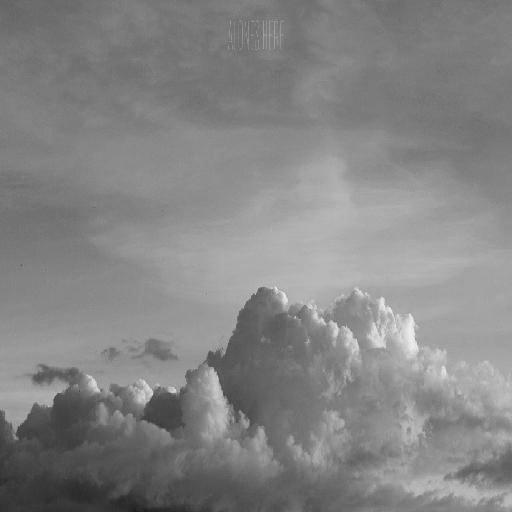

# **Color the Sky: A Machine Learning Model for Image Colorization**

Project created for HackGT 7.
https://devpost.com/software/color_the_sky


 Team members: Thinh Pham, Ian Carpenter, Thao Tran
# 
**Table of Contents**


*   [Color the Sky: A Machine Learning Model for Image Colorization](https://github.com/thinhpham2122/Color_the_Sky)
*   [Table of Contents](https://github.com/thinhpham2122/Color_the_Sky#table-of-contents)
    *   [Objective](https://github.com/thinhpham2122/Color_the_Sky#objective)
    *   [What does it do?](https://github.com/thinhpham2122/Color_the_Sky#what-does-it-do)
    *   [How was it built?](https://github.com/thinhpham2122/Color_the_Sky#built)
    *   [Challenges](https://github.com/thinhpham2122/Color_the_Sky#challenges)
    *   [Usage](https://github.com/thinhpham2122/Color_the_Sky#usage)

## 
**Inspiration and Objective**


Color the Sky’s intention, as a project, is to create a machine learning model capable of colorizing black and white or grayscale images and providing those colorized images as output. This particular project’s scope is presently limited to a focus on colorizing images of the sky, which is what the model was trained on. 

The aim of doing this is both provide the basis for an image colorization model for future use and to educate on the process of creating and applying such a model. 


## 
**What does it do?**

Given an input image, Color the Sky resamples to a 512x512 px resolution to standardize the images placed in the raw_image folder. The resized images are output into the feature folder, which is when the trained model steps in. 
The Color the Sky model takes the black and white images in the feature folder and applies colorization. The model looks at the difference between the gray scale and the colored images and tries to tune it’s parameters to map one image to another. The model consists of several convolution layers and uses the Adam optimizer to learn the parameter. The result after training is a model that can take any image that resembles the training data and produce a colorized version of it.

Example Before and After Images:
| 
---|---
| 

| 
---|---
| 

---


## 
**How it was Built**

The program is built using Python with TensorFlow with the Keras API, Numpy, and Pillow.

The images are processed using Java, JDK-11.0.8 with the Java util, awt, io, and imageio packages.

IDE: PyCharm, IntelliJ


## 
**Challenges**

With the limited timeframe of the Hackathon, both creating the framework for and training the model was a challenge.  

Sourcing sufficient and satisfactory training data for the project was also something that had to be done. There are many datasets available online for projects such as these, but given the focus on training using images of the sky, a custom dataset was produced by crawling Google and Yandex image results and then sorting those images.

While a usable model was produced, there are limitations to the accuracy of the colorization. However, as aforementioned, given the time frame within which this was produced, it is serviceable in its primary application. 


## 
**Usage**

The main file of interest for applying Color The Sky is `run.py`. A full list of arguments with descriptions can be found in that file; here we describe those relevant to getting started.


### 
**Data**

By default, input data for `run.py` should be placed in `./feature`. However, this assumes images have already been downscaled and otherwise prepared. If you have data that is not already in the expected form, place it in `raw_image` and run `ImageProcessor.java` which will automatically do this for you. 

ImageProcessor.java

In order to use this file, users can configure the two following variable:


*   inPath: The path to the images folder
*   outPath: The path to the target output folder

### 
**Application**


Once your data is in the appropriate directories, all you need to do is


```
python run.py
```


Relax while you await for your images to be colorized. Geniessen!
